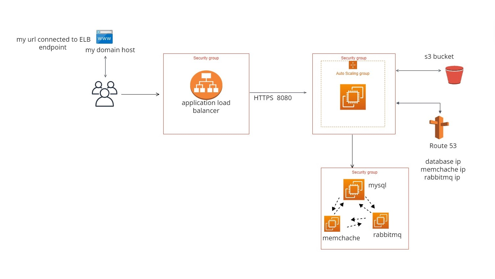

HELLO !

I HAVE DONE A PROJECT :  DEPLOYING A JAVA WEB APPLICATION ON CLOUD

 BY USING THE AWS RESOURCES LIKE :

1. AWS EC2
2. AWS SECURITY GROUPS
3. AWS LOAD BALANCER (APPLICATION TYPE)
4. AWS ROUTE 53 
5. S3 BUCKET 
6. AUTO SCALING 
7. CREATING AMI .
8. USING A DOMAIN WHICH IS ATTACHED TO THE LOAD BALANCER END POINT .

 I HAVE CREATED 4 INSTANCES OF TOTAL ,
    1. TOMCAT 
    2. MARIADB 
    3. MEMCHACHE
    4. RABBITMQ
I HAVE CREATED 3 SEQURITY GROUPS FOR THE
    1. TOMCAT SERVER
    2. LOAD BALANCER
    3. BACKEND SERVERS 
    SECURITY GROUP OF LOAD BALANCER : .
    THE SECQURITY GROUP MENTIONED IN THE SOURCE SECTION IS TOMCAT SERVER SEQURITY GROUP. 

    FOR TOMCAT SERVER :
    1. I HAVE OPENED PORT 8080 FROM LOAD BALANCER .
    2. SSH FROM MY IP FOR TROUBLESHOOT.

    AND FOR LOAD BALANCER :
    1. I HAVE OPENED HTTP AND HTTPS FROM ANYWHERE .

LOAD BALANCER :
  1. I HAVE CHOSEN APPLICATION LOAD BALANCER .
  2. I HAVE CREATED A TARGET GROUP OF TOMCAT SERVER AND ATTACHED IT TO THE LOAD BALANCER .
  3. THROUGH ACM I HAVE A CERTIFIED SUB-DOMAIN . I HAVE  ATTACHED IT TO THE LOAD BALANCER FOR THE "HTTPS".

ROUTE 53 :
  1. I HAVE ENTERED THE PRIVATE IP'S OF THE BACKEND INSTANCES  WITH A  NAME  TO BE CALLED BY TOMCAT INSTANCE WHEN REQUIRED. 

AMI : 
 1. I HAVE CREATED  A AMI OF THE INSTANCE  ON WHICH TOMCAT IS RUNNING .
 2. THEN I CREATED A LAUNCH TEMPLETE FROM THE AMI . 

AUTO SCALING :
 1 . THROUGH THE AMI I HAVE CONFIGURED THE AUTO SCALING GROUP. TO SCALE UP AND DOWN WHEN REQURIED . 

DOMAIN MANGER :
1. IN MY DOMAIN MANAGER IN TJE CNAME SECTION , I HAVE CONFIGURED MY DOMAIN WITH THE LOAD BALANCER ENDPOINT. SO I CAN GET THE APPLICATION THROUGH MY DOMAIN.   

THEN AFTER TROUBLE SHOOTING FOR SOME TIME I GOT :
  

THEN I GOT SIGNED UP :
 

AND !!!!!!! RESULT :

